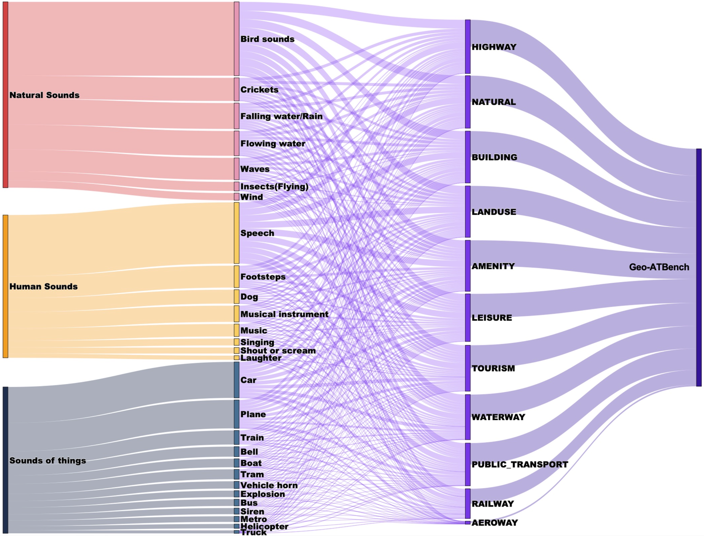
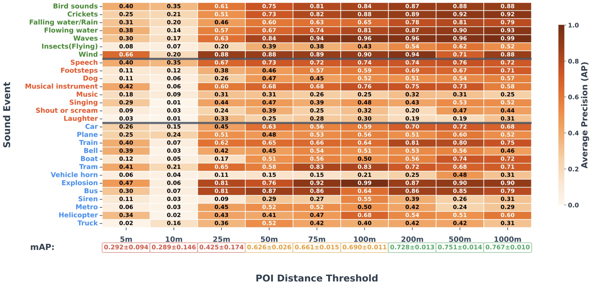
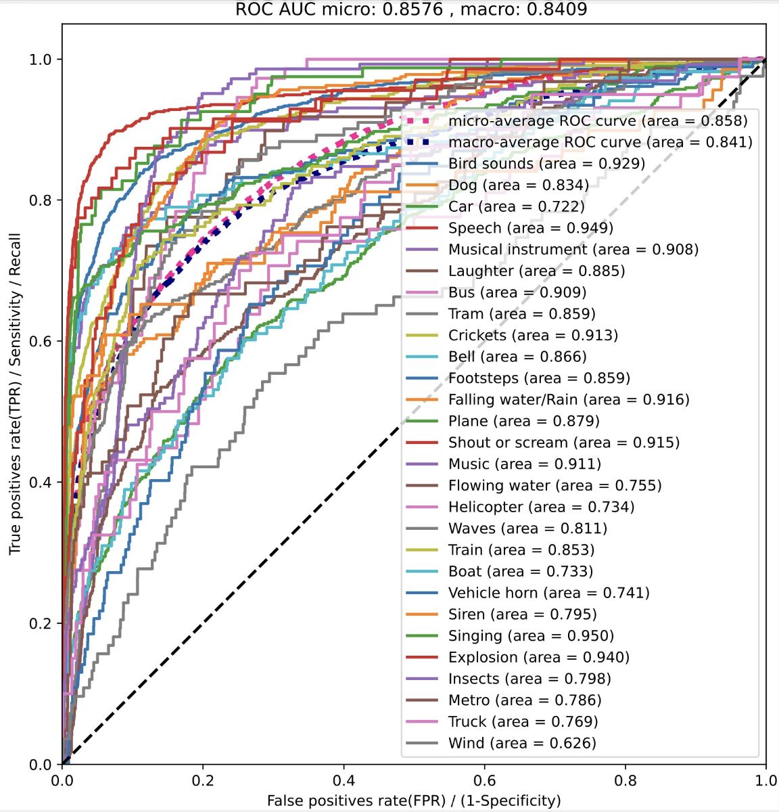
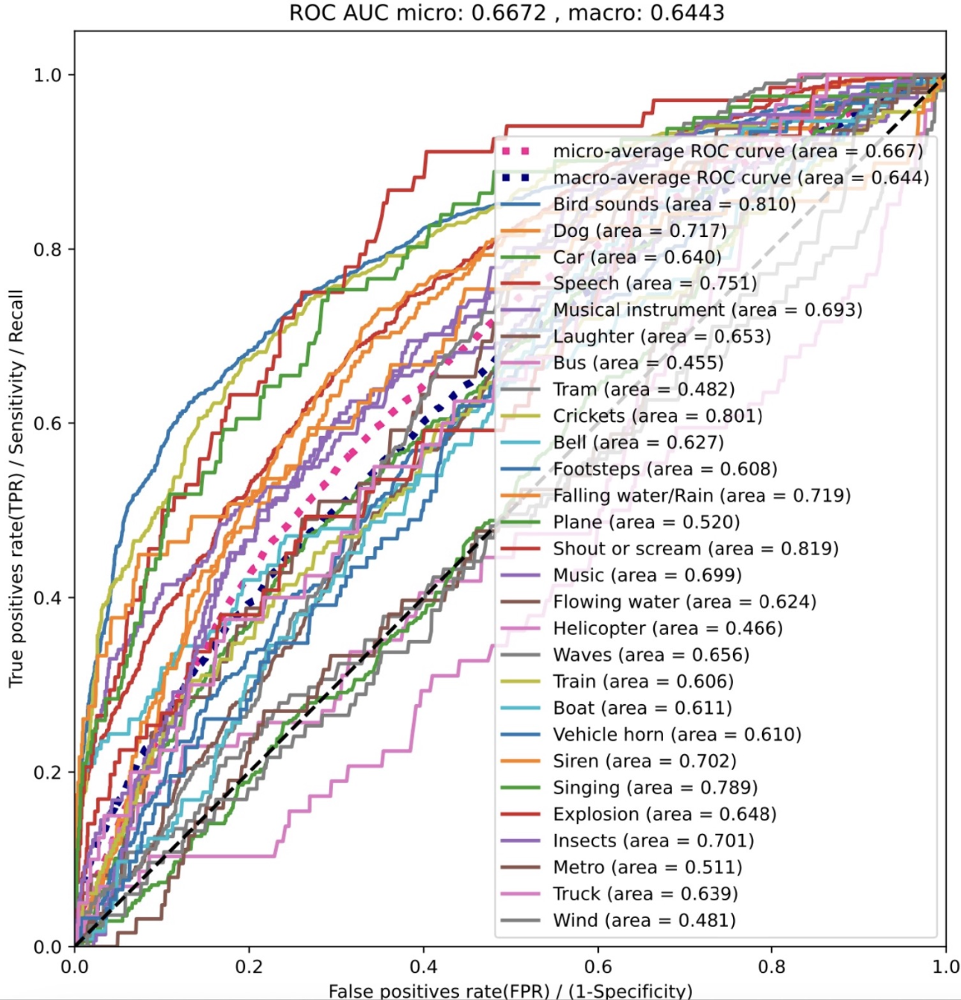
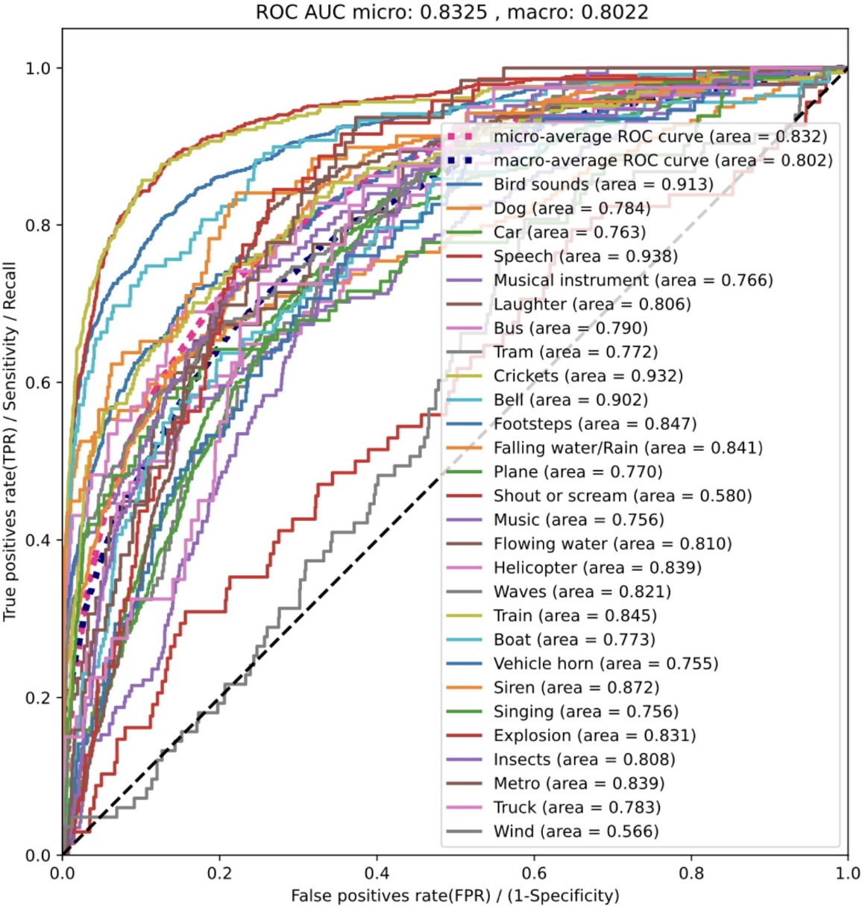

# Geo-ATBench

**Paper:** https://arxiv.org/abs/2603.10623  
**Dataset:** https://zenodo.org/records/18980673 

**Geo-ATBench** is a geographically annotated polyphonic audio benchmark containing 3,854 real-world audio clips (about 10 hours) with 28 sound event labels. Each clip is paired with a Geospatial Semantic Context (GSC) representation derived from Point-of-Interest (POI) information in OpenStreetMap, capturing the semantic characteristics of the recording location across 11 contextual categories (e.g., residential, industrial, nature). By linking audio events with their surrounding geographic environment—such as a siren recorded near a hospital or birds recorded near a park—Geo-ATBench provides a new benchmark for studying how geospatial semantics interact with acoustic representations and enables reproducible research on context-aware audio tagging.


In the [paper](https://arxiv.org/abs/2603.10623) , we argue that sound should not be treated as an isolated signal but as a physical event embedded in a specific place, and we introduce the concept of Geospatial Semantic Context to provide AI systems with a “sense of place” alongside their “sense of hearing”, enabling more reliable understanding of real-world audio in applications such as smart cities, safety monitoring, and wildlife observation.


To track the performance of models on the Geo-ATBench dataset, we maintain a dedicated **leaderboard** homepage, which is available at
https://github.com/WuYanru2002/Geo-ATBench-Leaderboard

## Updates

**September 2, 2026** Additional supplementary materials have been uploaded, including overlap analysis and sound-event geographic feature analysis. These materials provide further analyses of POI overlap across data partitions, sound-event–POI associations, geographic coverage, and GSC-only baseline results.
https://github.com/WuYanru2002/Geo-ATBench/tree/main/Supplementary_analysis

---

## Repository Overview

### 1. Training Code

The `code_for_train/` directory includes scripts for:

- **Audio-only training&evaluation**
- **Multimodal training&evaluation**
- **Dataset splitting and preprocessing** - This will generate 5 independent dataset splits

### 2. Zero-Shot Inference

Scripts for zero-shot inference using pretrained models:

- `Inference_PANNs.py`
- `Inference_AST.py`
- `Inference_CLAP.py`

The `AudioSet-to-Geo-ATBench_mapping_table.json` enables compatibility between Geo-ATBench and AudioSet label spaces.

### 3. GSC-Based Classification

- `GSC_only.py` performs classification using only GSC features.
- `get_GSC_feature.py` extracts GSC feature representations from text embeddings using a pretrained BERT model.

### 4. Example

An example audio file and its corresponding metadata.


---

## Dataset Overview

- **Total Audio Clips**: 3,854
- **Total Duration**: 10 hours, 42 minutes, and 20 seconds
- **Audio Format**: 10-second, single-channel (mono) WAV files with 16 kHz sample rate and 16-bit depth.
- **Labels**:
  - **28 fine-grained event classes or 3 coarse-grained event classes**
  - **11 semantic POI context classes**
  - **Multi-label classification** (multiple events can occur in a single recording)

---

## Dataset Categories

### Coarse-grained Categories and Fine-grained Categories

| Coarse-grained Category       | Fine-grained Categories                                     |
|-----------------------|------------------------------------------------------|
| **1. Natural Sounds** | Bird sounds, Crickets, Falling water/Rain, Flowing water, Waves, Insects (Flying), Wind |
| **2. Human Sounds**   | Speech, Footsteps, Dog, Musical instrument, Music, Singing, Shout or scream, Laughter |
| **3. Sounds of Things** | Car, Plane, Train, Bell, Boat, Tram, Vehicle horn, Explosion, Bus, Siren, Metro, Helicopter, Truck |

---

## An Example of the dataset

This repository provides an example audio clip and its corresponding metadata from our Geo-ATBench dataset.

### Provided Files

- `example.wav` — a 10-second environmental audio clip  
- `example.json` — the corresponding metadata file

### Metadata Format

Each audio clip is paired with a JSON metadata entry.

The metadata includes:

- `id` — unique clip identifier. 
- `poi_texts` — OpenStreetMap (OSM)-based geographic semantic attributes extracted from the area surrounding the audio recording location.   
  OSM entities within this region are queried based on 11 predefined OSM feature keys (e.g., land use, amenities, natural features, highways, buildings, etc.).  
  The retrieved key-value attributes are stored as structured semantic text entries describing the geographic scene context.
- `segments` — Multi-label audio event annotations.  
  Each segment includes its `label`.  
  Multiple event labels may appear within a single audio clip.

**Note**: To prevent the disclosure of sensitive information, the dataset does not include the precise GPS locations of the audio recordings.

---

## Event and Context Annotation

- **Semantic Context Labeling**: For each audio clip with GPS coordinates, the corresponding location was queried using the OpenStreetMap (OSM) database. Points of Interest (POIs) within a defined square around the location were identified based on 11 OSM feature keys, covering categories such as land use, amenities, and natural features.
  
- **Sound Event Labeling**: Sound event labels were derived from user-provided tags on Freesound. These tags were curated into a controlled vocabulary, resulting in 28 fine-grained event classes. These 28 classes were grouped into three coarse-grained categories:
  1. **Natural Sounds**: Environmental phenomena (e.g., wind, rain, water)
  2. **Human Sounds**: Sounds produced by humans (e.g., speech, footsteps, music)
  3. **Sounds of Things**: Mechanical, electronic, and man-made sounds (e.g., cars, sirens, explosions)

---




*Figure 1. Distribution of dataset size across categories.*


---

## Baseline Analysis

### 1. POI-Only Classification

The performance of the POI-Only classification is shown below:



*Figure 2. POI-Only Classification Results.*

---

### 2. Zero-Shot Audio Classification

Below are the results of the zero-shot audio classification, with 3 models evaluated on the dataset:

#### The ROC Curves of PANNs, AST, and CLAP:

<div style="display: flex; justify-content: space-between; flex-wrap: wrap;">
  
  
  
</div>

*Figure 3. The ROC Curves of PANNs, AST, and CLAP.*

---

### 3. Fine-Tuned Classification Results (Intermediate Fusion)

The fine-tuned classification results (`mAP`) across 28 fine-grained categories and 3 coarse-grained categories are presented in the table below:

| Model   | Audio-Only | Multimodal(Intermediate-Fusion) |
|---------|-----------------|---------------|
| **PANNs**| 0.770      | 0.824      |
| **AST**  | 0.820      | 0.829      |
| **CLAP** | 0.824      | 0.842      |

*Table 1. 28 fine-grained categories Fine-Tuned Classification Results on Geo-ATBench Dataset.*

| Model   | Audio-Only | Multimodal(Intermediate-Fusion) |
|---------|-----------------|---------------|
| **PANNs**| 0.961      | 0.964      |
| **AST**  | 0.904      | 0.912      |
| **CLAP** | 0.966      | 0.968      |

*Table 2. 3 coarse-grained categories Fine-Tuned Classification Results on Geo-ATBench Dataset.*

---

## Citation

If you use **Geo-ATBench**, please cite:

```bibtex
@misc{hou2026geoatbenchbenchmarkgeospatialaudio,
      title={Geo-ATBench: A Benchmark for Geospatial Audio Tagging with Geospatial Semantic Context}, 
      author={Yuanbo Hou and Yanru Wu and Qiaoqiao Ren and Shengchen Li and Stephen Roberts and Dick Botteldooren},
      year={2026},
      eprint={2603.10623},
      archivePrefix={arXiv},
      primaryClass={eess.AS},
      url={https://arxiv.org/abs/2603.10623}, 
}

