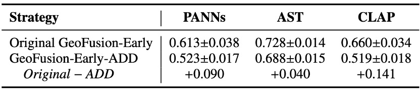

# GeoFusion-Early: Original vs. ADD Implementation

## Comparison Figure

**Figure 1.** Comparison of the F1-score between the original GeoFusion-Early implementation and the additive-fusion (GeoFusion-Early-ADD) implementation across different backbones.

As shown in **Figure 1**, the original GeoFusion-Early achieves higher F1 than GeoFusion-Early-ADD for all backbones. The differences between the original and ADD implementations are **0.090** for **PANNs**, **0.040** for **AST**, and **0.141** for **CLAP**. These results show that the backbone-adapted original implementations achieve higher F1 values across all three backbones, and the exact early-fusion implementation can affect the magnitude of the results.