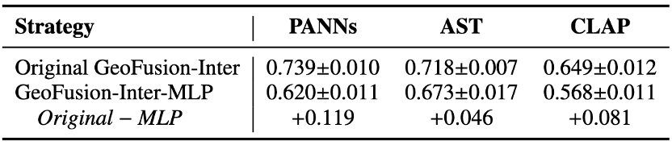

# GeoFusion-Inter: Original vs. MLP Baseline

## Comparison Figure

**Figure 1.** Comparison of the F1-score between the original GeoFusion-Inter implementation and the GeoFusion-Inter-MLP baseline across different backbones.

As shown in **Figure 1**, the original GeoFusion-Inter achieves higher F1 than GeoFusion-Inter-MLP for all three backbones. The differences are **0.119** for **PANNs**, **0.046** for **AST**, and **0.081** for **CLAP**. These results show that the original cross-modal attention implementation performs better overall across the three backbones.