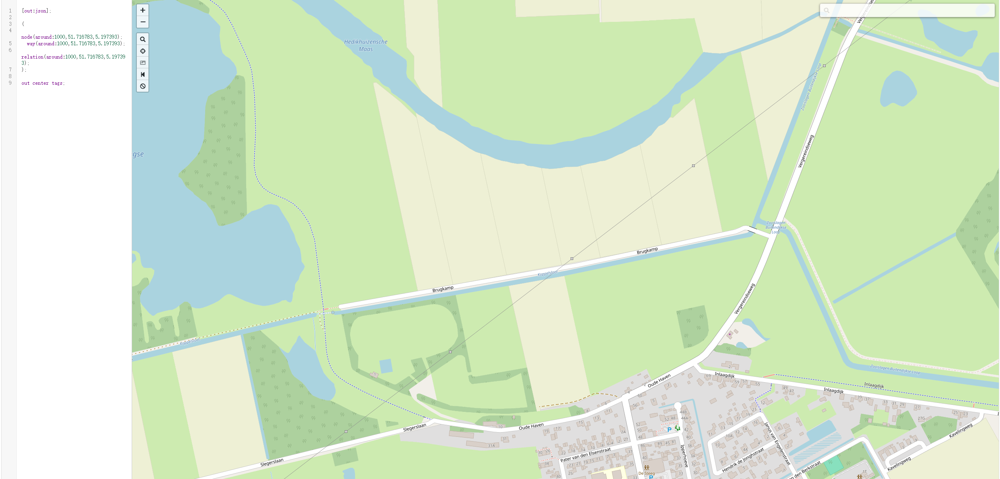

# GPS/OSM Re-checking Example

This folder provides a concrete example of the additional GPS/OSM re-checking procedure used during annotation. It includes the GPS coordinate, Overpass QL query, query-result file, and an Overpass Turbo interactive-map visualization.

## Example coordinate

- Latitude: `51.716783`
- Longitude: `5.197393`
- Search radius: `1000 m`

## Overpass QL query

Run the following query in [Overpass Turbo](https://overpass-turbo.eu/):

```overpass
[out:json][timeout:25];
(
  node(around:1000,51.716783,5.197393);
  way(around:1000,51.716783,5.197393);
  relation(around:1000,51.716783,5.197393);
);
out center tags;
```

The query retrieves OpenStreetMap nodes, ways, and relations within 1000 m of the coordinate, including their tags and the center coordinates of linear or area entities.

## Query result

Place the exported JSON response from Overpass Turbo in this folder with the following name:

`overpass_query_results.json`

## Interactive-map visualization

Add the following screenshot exported from Overpass Turbo after running the query above. It should show the query in the left panel and the retrieved OSM entities on the interactive map in the right panel.




## How this example was used during annotation

Annotators first used the released geographic semantic context (GSC), derived from OSM entities queried around the recording coordinate, together with the title, description, tags, and any explicit location information supplied by the Freesound uploader. GSC indicates which geographic entities and attributes occur in the surrounding area, such as restaurants, forests, roads, or beaches; it does not retain their exact direction, distance, or relative proximity to the recording point. When the auditory evidence and these sources left an example ambiguous, annotators used Overpass Turbo to inspect the retrieved entities on an interactive map. This additional check made it possible to judge whether GSC entities were adjacent to the recording location, formed a plausible environmental combination, or occurred only at the edge of the queried area.
