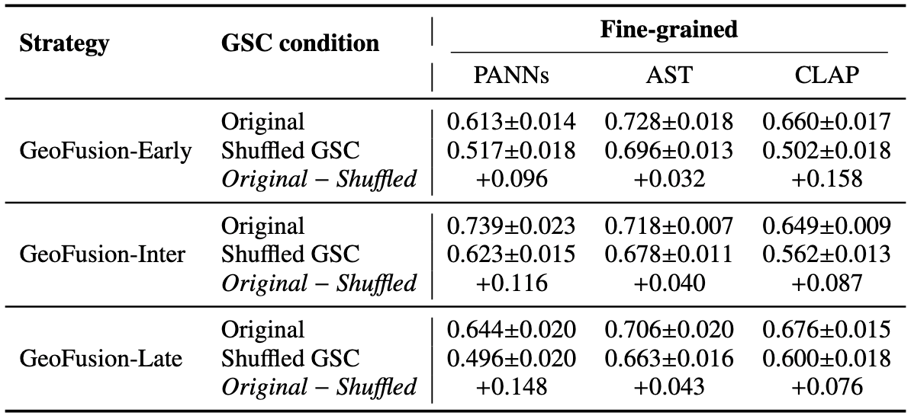
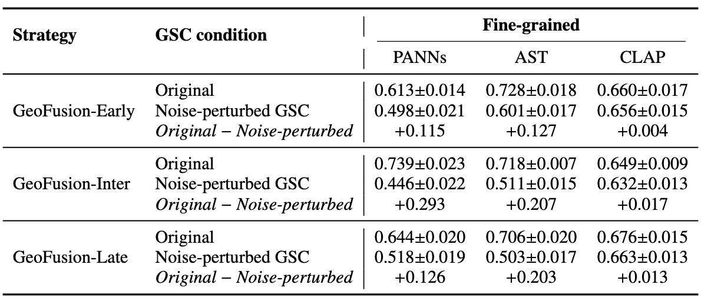

# GSC Shuffle and Noise Perturbation

As shown in Table 1, shuffling the GSC decreases F1 across all backbone–fusion configurations, with performance drops ranging from 0.032 to 0.158. For example, GeoFusion-Early-CLAP decreases from 0.660 to 0.502, corresponding to a decrease of 0.158. Since the shuffled inputs are still valid GSC representations drawn from the same Test set, the dataset-level GSC information remains present, while its sample-specific correspondence with the audio is removed. The degradation shows that an incorrectly matched geographic context can mislead the fusion model and that the performance gain depends on the correct Audio–GSC correspondence.

As shown in Table 2, noise perturbation also decreases F1 across all configurations, but the magnitude varies across backbones. The PANNs-based models decrease by 0.115–0.293, and the AST-based models decrease by 0.127–0.207. In particular, GeoFusion-Inter-PANNs shows the largest decrease, from 0.739 to 0.446. In contrast, the CLAP-based models are less affected by the GSC perturbation. One reason may be the contrastive pre-training mechanism of CLAP. The CLAP audio representation is trained to capture high-level semantic information through audio–text contrastive learning, which can provide a relatively strong semantic acoustic representation when the auxiliary GSC vector is perturbed. So, the CLAP-based fusion models remain comparatively robust to perturbations in the GSC representation.

The shuffled GSC experiment randomly replaces the GSC of each Test sample with a valid GSC from another Test sample to examine the importance of the correct Audio–GSC correspondence. The noise perturbation experiment preserves the original Audio–GSC pairs while perturbing the BERT-embedding-based GSC representations with Gaussian noise to examine the robustness of the models to changes in the GSC information.
